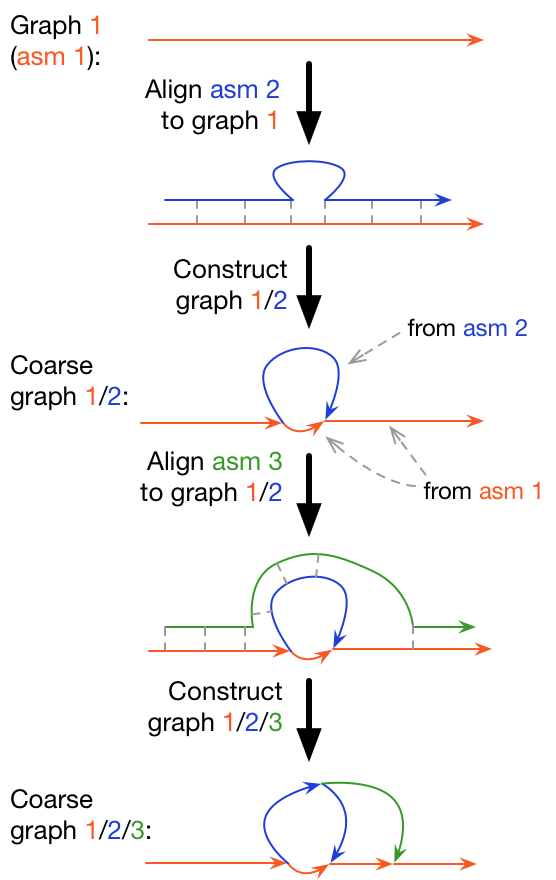

[](https://travis-ci.org/lh3/minigraph)
## <a name="started"></a>Getting Started

```sh
git clone https://github.com/lh3/minigraph
cd minigraph && make
# Map sequence to sequence, similar to minimap2 without base alignment
./minigraph test/MT-human.fa test/MT-orangA.fa > out.paf
# Map sequence to graph
./minigraph test/MT.gfa test/MT-orangA.fa > out.gaf
# Incremental graph generation (-l10k necessary for this toy example)
./minigraph -cxggs -l10k test/MT.gfa test/MT-chimp.fa test/MT-orangA.fa > out.gfa
# Call per-sample path in each bubble/variation (-c not needed for this)
./minigraph -xasm -l10k --call test/MT.gfa test/MT-orangA.fa > orangA.call.bed

# The lossy FASTA representation (requring https://github.com/lh3/gfatools)
gfatools gfa2fa -s out.gfa > out.fa
# Extract localized structural variations
gfatools bubble out.gfa > SV.bed
```

## Table of Contents



- [Getting Started](#started)
- [Introduction](#intro)
- [Users' Guide](#uguide)
  - [Installation](#install)
  - [Sequence-to-graph mapping](#map)
  - [Graph generation](#ggen)
  - [Calling structural variations](#callsv)
  - [Prebuilt graphs](#prebuilt)
  - [Algorithm overview](#algo)
- [Limitations](#limit)

## <a name="intro"></a>Introduction

Minigraph is a sequence-to-graph mapper and graph constructor. For graph
generation, it aligns a query sequence against a sequence graph and
incrementally augments an existing graph with long query subsequences diverged
from the graph. The figure on the right briefly explains the procedure.

Minigraph borrows ideas and code from [minimap2][minimap2]. It is fairly
efficient and can construct a graph from 90 human assemblies in a couple of
days using 24 CPU cores. Older versions of minigraph was unable to produce
base alignment. The latest version can. **Please add option `-c` for graph
generation** as it generally improves the quality of graphs.

## <a name="uguide"></a>Users' Guide

### <a name="install"></a>Installation

To install minigraph, type `make` in the source code directory. The only
non-standard dependency is [zlib][zlib]. For better performance, it is
recommended to compile with recent compliers.

### <a name="map"></a>Sequence-to-graph mapping

To map sequences against a graph, you should prepare the graph in the [GFA
format][gfa1], or preferrably the [rGFA format][rgfa]. If you don't have
a graph, you can generate a graph from multiple samples (see the [Graph
generation section](#ggen) below). The typical command line for mapping is
```sh
minigraph -cx lr graph.gfa query.fa > out.gaf
```
You may choose the right preset option `-x` according to input. Minigraph
output mappings in the [GAF format][gaf], which is a strict superset of the
[PAF format][paf]. The only visual difference between GAF and PAF is that the
6th column in GAF may encode a graph path like
`>MT_human:0-4001<MT_orang:3426-3927` instead of a contig/chromosome name.

The minigraph GFA parser seamlessly parses FASTA and converts it to GFA
internally, so you can also provide sequences in FASTA as the reference. In
this case, minigraph will behave like minimap2, though likely producing
different alignments due to differences between the two implementations.

### <a name="ggen"></a>Graph generation

The following command-line generates a graph in rGFA:
```sh
minigraph -cxggs -t16 ref.fa sample1.fa sample2.fa > out.gfa
```
which is equivalent to
```sh
minigraph -cxggs -t16 ref.fa sample1.fa > sample1.gfa
minigraph -cxggs -t16 sample1.gfa sample2.fa > out.gfa
```
File `ref.fa` is typically the reference genome (e.g. GRCh38 for human).
It can also be replaced by a graph in rGFA. Minigraph assumes `sample1.fa` to
be the whole-genome assembly of an individual. This is an important assumption:
minigraph only considers 1-to-1 orthogonal regions between the graph and the
individual FASTA. If you use raw reads or put multiple individual genomes in
one file, minigraph will filter out most alignments as they cover the input
graph multiple times.

The output rGFA can be converted to a FASTA file with [gfatools][gfatools]:
```sh
gfatools gfa2fa -s graph.gfa > out.stable.fa
```
The output `out.stable.fa` will always include the initial reference `ref.fa`
and may additionally add new segments diverged from the initial reference.

### <a name="callsv"></a>Calling structural variations

A minigraph graph is composed of chains of bubbles with the reference as the
backbone. Each *bubble* represents a structural variation. It can be
multi-allelic if there are multiple paths through the bubble. You can extract
these bubbles with
```sh
gfatools bubble graph.gfa > var.bed
```
The output is a BED-like file. The first three columns give the position of a
bubble/variation and the rest of columns are:

* (4) \# GFA segments in the bubble including the source and the sink of the bubble
* (5) \# all possible paths through the bubble (not all paths present in input samples)
* (6) 1 if the bubble involves an inversion; 0 otherwise
* (7) length of the shortest path (i.e. allele) through the bubble
* (8) length of the longest path/allele through the bubble
* (9-11) please ignore
* (12) list of segments in the bubble; first for the source and last for the sink
* (13) sequence of the shortest path (`*` if zero length)
* (14) sequence of the longest path (NB: it may not be present in the input samples)

Given an assembly, you can find the path/allele of this assembly in each bubble with
```sh
minigraph -cxasm --call graph.gfa sample-asm.fa > sample.bed
```
On each line in the BED-like output, the last colon separated field gives the
alignment path through the bubble, the path length in the graph, the mapping
strand of sample contig, the contig name, the approximate contig start and
contig end. The number of lines in the file is the same as the number of lines
in the output of `gfatools bubble`. You can use the `paste` Unix command to
piece multiple samples together.

### <a name="prebuilt"></a>Prebuilt graphs

Prebuilt human graphs in the rGFA format can be found [at Zenodo][human-zenodo].

### <a name="algo"></a>Algorithm overview


In the following, minigraph command line options have a dash ahead and are
highlighted in bold. The description may help to tune minigraph parameters.

1. Read all reference bases, extract (**-k**,**-w**)-minimizers and index them
   in a hash table.

2. Read **-K** [=*500M*] query bases in the mapping mode, or read all query
   bases in the graph construction mode. For each query sequence, do step 3
   through 5:

3. Find colinear minimizer chains using the [minimap2][minimap2] algorithm,
   assuming segments in the graph are disconnected. These are called *linear
   chains*.

4. Perform another round of chaining, taking each linear chain as an anchor.
   For a pair of linear chains, minigraph tries to connect them by doing graph
   wavefront alignment algorithm (GWFA). If minigraph fails to find an
   alignment within an edit distance threshold, it will find up to 15 shortest
   paths between the two linear chains and chooses the path of length closest
   to the distance on the query sequence. Chains found at this step are called
   *graph chains*.

5. Identify primary chains and estimate mapping quality with a method similar
   to the one used in minimap2. Perform base alignment.

6. In the graph construction mode, collect all mappings longer than **-d**
   [=*10k*] and keep their query and graph segment intervals in two lists,
   respectively.

7. For each mapping longer than **-l** [=*100k*], finds poorly aligned regions.
   A region is filtered if it overlaps two or more intervals collected at step
   6.

8. Insert the remaining poorly aligned regions into the input graph. This
   constructs a new graph.

## <a name="limit"></a>Limitations

* A complex minigraph subgraph is often suboptimal and may vary with the order
  of input samples. It may not represent the evolution history
  or the functional relevance at the locus. Please *do not overinterpret*
  complex subgraphs. If you are interested in a particular subgraph, it is
  recommended to extract the input contig subsequences involved in the subgraph
  with the `--call` option and manually curated the results.

* Minigraph needs to find strong colinear chains first. For a graph consisting
  of many short segments (e.g. one generated from rare SNPs in large
  populations), minigraph will fail to map query sequences.

* The base alignment in the current version of minigraph is slow for species of
  high diversity.


[zlib]: http://zlib.net/
[minimap2]: https://github.com/lh3/minimap2
[rgfa]: https://github.com/lh3/gfatools/blob/master/doc/rGFA.md
[gfa1]: https://github.com/GFA-spec/GFA-spec/blob/master/GFA1.md
[gaf]: https://github.com/lh3/gfatools/blob/master/doc/rGFA.md#the-graph-alignment-format-gaf
[paf]: https://github.com/lh3/miniasm/blob/master/PAF.md
[gfatools]: https://github.com/lh3/gfatools
[bandage]: https://rrwick.github.io/Bandage/
[gfaviz]: https://github.com/ggonnella/gfaviz
[human-zenodo]: https://zenodo.org/record/6499594
